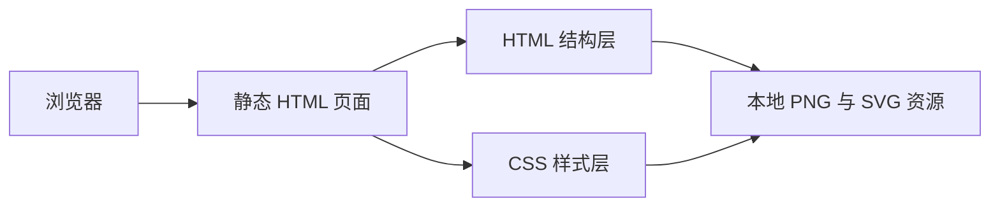

## 1. 架构设计

## 2. 技术描述
- 前端：原生 HTML5 + CSS3 + 少量原生 JavaScript
- 页面类型：四个独立静态展示页
- 适配策略：固定画布 + 居中缩放
- 开发原则：最大化复用 Figma 导出的结构与样式，减少手工重写带来的视觉偏差

## 3. 路由定义
| 路由 | 用途 |
|------|------|
| `/page2_1360.html` | 展示典型雁种页面高还原实现 |
| `/page2_945.html` | 展示迁徙旅程页面高还原实现 |
| `/page2_1450.html` | 展示结语1页面高还原实现 |
| `/page2_1460.html` | 展示结语2页面高还原实现 |

## 4. 接口定义
- 四个页面均为纯静态展示页，不依赖后端接口
- 所有图形、文案和装饰均通过本地结构、样式与静态资源完成

## 5. 数据与资源策略
### 5.1 资源使用
- 优先使用 `.figma/image/` 下的导出 PNG 和 SVG 资源
- 对于简单背景、光斑、描边与几何形状，直接使用 HTML/CSS 复建
- 对于雁类插图、编队机制、波浪背景与复杂示意图，保留导出资源作为图片节点或背景层

### 5.2 还原策略
- 根容器统一为 1920x1080 固定尺寸，整体作为单一缩放基准
- 保留原稿中的透明度、模糊、旋转角度、层级和相对坐标
- 使用绝对定位和原始布局关系呈现物种图谱与飞行机制示意
- 对结语页保持极简排版，仅用文字、光斑和箭头形成收束节奏
- 页脚中英文标题与现有页面保持统一收尾样式

## 6. 结构拆分
| 页面 | 模块 | 实现方式 |
|------|------|----------|
| 2_1360 | 顶部信息带 | 背景图 + 标题标签 + 统计信息与装饰光斑 |
| 2_1360 | 物种图谱区 | 五个物种图片、文本标签、连线和底部椭圆舞台 |
| 2_1360 | 趋势图区 | 占比圆环、趋势图例、总结语和箭头素材 |
| 2_945 | 阶段流程区 | 顶部迁徙节点、圆标图示和路径线 |
| 2_945 | 机制主图区 | 倾斜地平线、分栏标题、示意雁阵、说明文字 |
| 2_945 | 右侧总结区 | 竖排总结语、箭头和页脚标题 |
| 2_1450 | 结语过渡区 | 双雾化光斑、短句正文、箭头素材和页脚标题 |
| 2_1460 | 最终结语区 | 长段结论、返回首页提示、下箭头和页脚标题 |

## 7. 验收标准
- 四页首屏构图与设计截图保持高一致度
- 图文布局、间距、透明度和主视觉位置接近原稿
- 浏览器中无资源 404、无明显错位、无控制台报错
