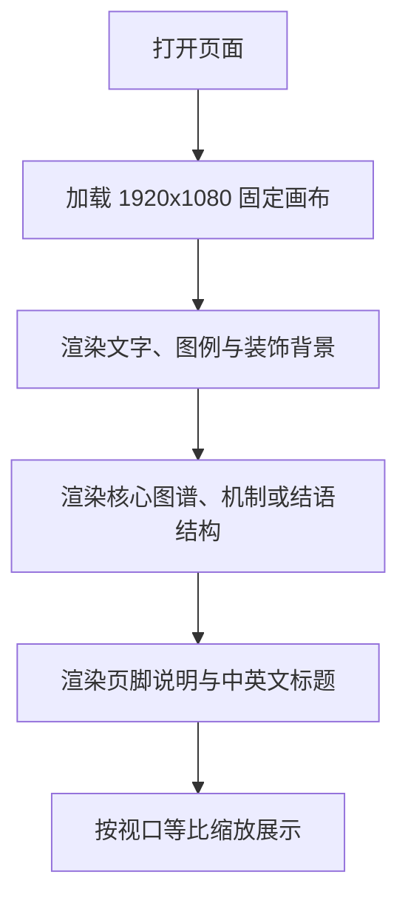

## 1. 产品概述
基于提供的 Figma 截图与导出结构，生成四个 1920x1080 的单页信息可视化网页，分别对应“典型雁种”“迁徙旅程”“结语1”“结语2”，要求高度还原版式、图文层级、素材位置与配色关系。
- 页面用于补充“2025年雁类迁徙信息可视化”专题的物种介绍、迁徙机制与结语收束，形成连续的叙事链路。
- 交付目标以桌面端本地预览和截图验收为主，优先保证单屏海报式视觉复现。

## 2. 核心功能
### 2.1 功能模块
1. **典型雁种页面**：展示五种典型雁类、基础信息、种群结构与趋势。
2. **迁徙旅程页面**：展示迁徙阶段、飞行机制、编队协作与信息共享逻辑。
3. **结语页面组**：展示主题总结、保护结论与返回首页提示。
4. **本地预览入口**：每页均提供可直接打开的静态入口。

### 2.2 页面明细
| 页面名称 | 模块名称 | 功能说明 |
|-----------|-----------|-----------|
| 2_1360 页面 | 顶部信息带 | 页面标题、引导句、关键指标和装饰背景 |
| 2_1360 页面 | 物种图谱区 | 五种雁类素材、学名、特征标签和辅助连线 |
| 2_1360 页面 | 趋势图区 | 占比、趋势、整体下降说明与页脚文案 |
| 2_945 页面 | 迁徙阶段区 | 决定迁徙、集群准备、长途飞行、停歇补给、越冬繁殖 |
| 2_945 页面 | 飞行机制区 | 空气动力学、领航轮换、间距控制、沟通、安全应急 |
| 2_945 页面 | 右侧说明区 | 竖排导语、编队价值总结与页脚标题 |
| 2_1450 页面 | 结语过渡区 | 双侧雾化渐变光斑、主题总结短句、右箭头 |
| 2_1460 页面 | 最终结语区 | 核心总结段落、返回首页提示、下箭头、页脚标题 |

## 3. 核心流程
用户打开任一页面后，立即看到完整单屏视觉稿；页面基于固定 1920x1080 画布居中展示，并按照浏览器视口进行等比缩放；用户无需交互即可完成浏览与截图验收。

## 4. 用户界面设计
### 4.1 设计风格
- 主色：雾白背景、低饱和粉蓝渐变、棕灰文字
- 辅色：浅蓝用于结构线和种群趋势，浅粉用于环境氛围与视觉平衡
- 标签样式：延续项目统一的细描边矩形标题标签
- 字体建议：中文使用 `PingFang SC`，英文装饰标题保留扩展衬线风格
- 布局风格：海报式绝对定位、留白充足、轻雾化氛围、低对比高级感
- 图形风格：环状图、虚线圆、椭圆底座、飞鸟编队、植物剪影和信息导线
- 结语风格：极简留白、双侧渐变雾化背景、轻量文字收束

### 4.2 页面设计概览
| 页面名称 | 模块名称 | UI 元素 |
|-----------|-----------|-----------|
| 2_1360 页面 | 顶部信息带 | 波浪背景、指标图标、标题标签、引导语 |
| 2_1360 页面 | 物种图谱区 | 五个物种主视觉、学名、特征短标签、连线与光圈 |
| 2_1360 页面 | 趋势图区 | 同心占比图、趋势圆点、说明文字和总结句 |
| 2_945 页面 | 阶段流程区 | 顶部路径线、阶段圆标、说明文字 |
| 2_945 页面 | 机制主图区 | 倾斜地平线、分栏机制、示意雁阵、信息节点 |
| 2_945 页面 | 右侧总结区 | 竖排导语、箭头、页脚标题 |
| 2_1450 页面 | 结语过渡区 | 双光斑背景、短结论文案、右向箭头 |
| 2_1460 页面 | 最终结语区 | 长段总结、返回首页提示、下箭头、简洁留白 |

### 4.3 响应式策略
- 采用桌面优先方案，以 1920x1080 为唯一设计基准
- 页面整体使用 `transform: scale()` 等比缩放
- 不做流式重排，保持素材位置、文字关系和图形比例稳定
