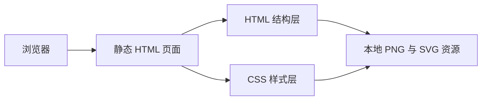

## 1. 架构设计

## 2. 技术描述
- 前端：原生 HTML5 + CSS3 + 少量原生 JavaScript
- 页面类型：单入口静态展示页
- 适配策略：固定画布 + 居中缩放
- 开发原则：优先保留 Figma 导出的层级、定位和素材关系，减少二次重构造成的偏差

## 3. 路由定义
| 路由 | 用途 |
|------|------|
| `/page2_653.html` | 展示因果链页面高还原实现 |

## 4. 接口定义
- 本页面不依赖后端接口
- 所有视觉元素均由本地静态资源、文本结构和样式完成

## 5. 数据与资源策略
### 5.1 资源使用
- 优先使用 `.figma/image/` 下的 PNG 和 SVG 导出资源
- 对于装饰线条、标题标签和简单几何图形，直接使用 HTML/CSS 绘制
- 对于流带、圆环、图标和复杂形状，保留导出资源作为背景或图片节点

### 5.2 还原策略
- 根容器保持 1920x1080 固定尺寸，内部全部采用绝对定位或原始导出布局
- 保留原稿中的低对比色、透明度、旋转方向、引线和流向关系
- 通过整体缩放适配视口，避免元素单独缩放带来的相对误差
- 保持页脚标题、装饰小鸟和植物素材的位置关系，与现有项目风格统一

## 6. 结构拆分
| 模块 | 实现方式 |
|------|----------|
| 根画布 | 固定尺寸容器，负责背景、定位和缩放基准 |
| 顶部说明区 | 文本和箭头素材组合，维持右上引导关系 |
| 驱动因素区 | 使用导出图片、圆环图标和说明文案组合 |
| 时间轴区 | 季节鸟类图片与分隔线、标签文字组合 |
| 因果链主图区 | 流带底图、竖向节点列、过程节点与三类影响结果组合 |
| 页脚区 | 中英文标题和辅助说明，保持项目统一收尾样式 |

## 7. 验收标准
- 页面整体构图与设计截图保持高一致度
- 因果链流向、节点位置、图文间距与颜色接近原稿
- 浏览器中资源无 404、无明显错位、无控制台报错
