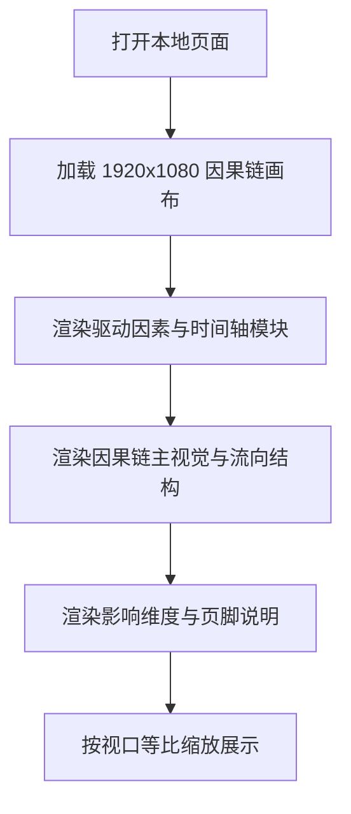

## 1. 产品概述
基于提供的 Figma 截图与导出结构，生成一个 1920x1080 的“迁徙影响因果链”单页信息可视化网页，高度还原页面中的因果链、驱动因素、时间轴与影响维度排布。
- 页面用于展示雁类迁徙从驱动因素到生态系统、物种生存和人类社会影响的完整链条。
- 产出优先保证单屏海报式视觉复现，适合本地预览、截图与后续多页串联。

## 2. 核心功能
### 2.1 功能模块
1. **因果链主展示页**：单屏固定构图，展示迁徙驱动因素、迁徙时间轴、迁徙过程和影响维度。
2. **本地预览入口**：可直接在浏览器打开进行视觉核对与验收。

### 2.2 页面明细
| 页面名称 | 模块名称 | 功能说明 |
|-----------|-----------|-----------|
| 2_653 页面 | 顶部说明区 | 右上英文标识、核心引导文案、箭头和标题标签 |
| 2_653 页面 | 驱动因素区 | 左上因素占比图、圆环节点、说明文字与引线 |
| 2_653 页面 | 时间轴区 | 四季迁徙节点、季节性图示与时间说明 |
| 2_653 页面 | 因果链主图区 | 左侧因素细分、中部迁徙过程、右侧影响维度三段式流向图 |
| 2_653 页面 | 底部说明区 | 页脚中英文标题与完整链条辅助说明 |

## 3. 核心流程
用户打开本地页面后，立即看到完整的因果链信息图；页面使用固定画布居中显示，并对不同视口进行等比缩放；用户无需滚动或交互即可完成浏览与截图比对。

## 4. 用户界面设计
### 4.1 设计风格
- 主色：雾白背景、低饱和粉蓝渐变、浅棕灰文字
- 辅色：粉色表示本能驱动链路，蓝色表示环境驱动链路，灰线用于因果连接
- 标签样式：细描边矩形标题标签，保持上一页统一体系
- 字体建议：中文使用 `PingFang SC`，英文装饰标题使用扩展衬线替代方案
- 布局风格：大幅留白、横向因果流、轻量海报视觉
- 图形风格：圆环、流带、线性引导、半透明羽翼与植物装饰

### 4.2 页面设计概览
| 页面名称 | 模块名称 | UI 元素 |
|-----------|-----------|-----------|
| 2_653 页面 | 顶部说明区 | 大号引导句、细箭头、右上英文标志 |
| 2_653 页面 | 驱动因素区 | 面积曲线、圆环指标、图标、说明文字 |
| 2_653 页面 | 时间轴区 | 四季鸟类素材、分隔线、时间标签 |
| 2_653 页面 | 因果链主图区 | 流带背景、节点图标、纵向图例、影响圈层 |
| 2_653 页面 | 页脚区 | 中英文标题、辅助说明和装饰小图 |

### 4.3 响应式策略
- 采用桌面优先方案，以 1920x1080 为唯一设计基准
- 页面整体使用 `transform: scale()` 等比缩放适配不同屏幕
- 不做流式重排，确保因果链路径、节点位置和说明文字保持稳定
