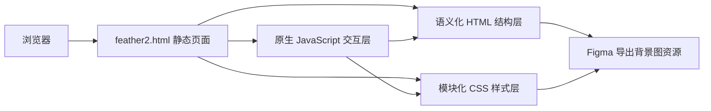

## 1. 架构设计

## 2. 技术描述
- 前端：原生 HTML5 + CSS3 + 原生 JavaScript
- 页面类型：单入口高还原静态展示页
- 布局策略：桌面优先固定画布 + 多断点响应式适配
- 样式组织：组件语义类命名 + CSS 自定义属性 + 分区注释
- 交互原则：仅对可聚焦元素添加克制动效，确保视觉不偏离原稿

## 3. 路由定义
| 路由 | 用途 |
|------|------|
| `/feather2.html` | 展示 `601:324` 节点对应的高还原封面页面 |

## 4. 接口定义
- 本页面不依赖后端接口
- 所有数据均以内嵌静态文案和本地图像资源呈现

## 5. 资源策略
### 5.1 图像资源
- 从 Figma 下载主背景图 `601:325` 与底部反射图 `601:326` 对应的裁切 PNG
- 背景图作为主体视觉层，反射图层保留原稿约 `0.14` 的透明度
- 右侧箭头优先使用 SVG 矢量结构，便于无损缩放和状态动画

### 5.2 字体策略
- 英文装饰标题使用 `Padyakke Expanded One` 字体风格，并提供 `Georgia`、`Times New Roman` 等衬线降级链
- 中文标题使用 `PingFang SC`、`Microsoft YaHei`、`Noto Sans SC` 等无衬线降级链
- 通过字距、行高和抗锯齿优化接近设计稿观感

## 6. 结构拆分
| 模块 | 实现方式 |
|------|----------|
| 页面根层 | `main` 作为主内容区域，承担背景与布局基准 |
| 视觉画布层 | `section` 作为海报画布，包含背景图、反射层和信息层 |
| 顶部标题层 | 独立 `header` 节点，右上绝对定位 |
| 导视箭头层 | `button` 或 `a` 语义节点承载 SVG 箭头与交互状态 |
| 底部信息层 | `footer` 节点承载中文标题与英文副标题 |

## 7. 响应式方案
- `>= 1440px`：保持接近原稿的绝对定位与尺寸
- `768px - 1439px`：按比例缩小文本与装饰元素，维持对角线构图关系
- `< 768px`：改用基于视口宽度的定位与字号缩放，确保标题完整可读且无横向滚动
- 使用 `clamp()`、CSS 变量与媒体查询控制尺寸、边距和对齐关系

## 8. 交互与动效方案
- 页面加载时，背景和文字执行短时淡入，保持低干扰、文献式节奏
- 箭头在 `hover` / `focus-visible` 状态下执行轻微下移和描边提亮
- 英文标题在 hover 时仅做弱透明度与字距变化，避免破坏原稿静态观感
- 所有动效需支持 `prefers-reduced-motion` 降级

## 9. 验收标准
- 页面整体尺寸、图像裁切、文字位置与 Figma 节点坐标高度一致
- 桌面端 Chrome DevTools 对比时，主要元素位置与尺寸偏差控制在 1px 内
- Chrome、Safari、Edge、Firefox 中无明显布局错位、字体溢出或脚本报错
- Lighthouse 可访问性优化目标不低于 95，重点覆盖语义结构、焦点可见性与对比度
