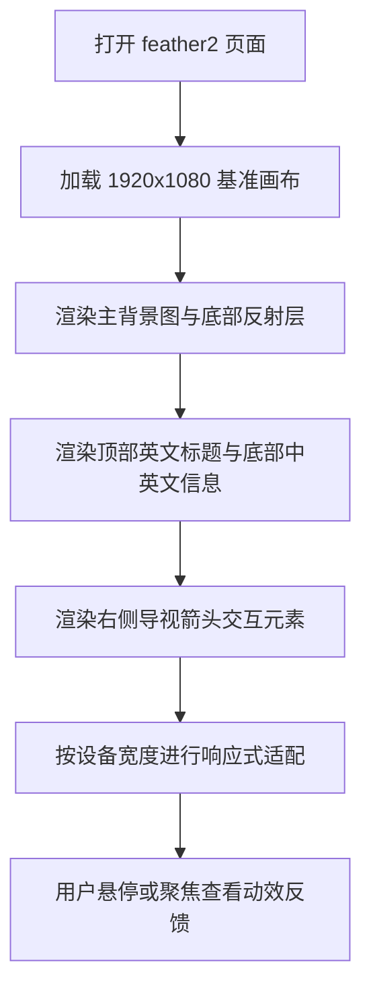

## 1. 产品概述
基于提供的 Figma 节点 `601:324`，实现一个 1920x1080 的单屏高还原展示页，用于呈现“日度单位观测数据 / 雁类迁徙信息可视化”主题封面，并完整复现背景主图、底部反射、标题文案与导视箭头。
- 页面目标是作为可视化项目的开场页或章节首页，强调信息气质、静态海报感和轻交互反馈。
- 交付需覆盖桌面、平板、手机等视口下的等比适配与细节还原，便于后续验收与展示。

## 2. 核心功能
### 2.1 功能模块
1. **主视觉封面页**：展示天空中雁群背景、底部弱透明反射层、页内标题和导视箭头。
2. **交互反馈层**：为可聚焦元素提供 hover、active、focus-visible 等状态与轻量动效。
3. **多端响应展示**：保持原稿视觉层级与构图关系，在不同设备宽度下稳定呈现。
4. **本地验收入口**：支持在浏览器直接打开页面进行像素比对、交互验收和截图核查。

### 2.2 页面明细
| 页面名称 | 模块名称 | 功能说明 |
|-----------|-----------|-----------|
| 601:324 页面 | 画布容器 | 提供 1920x1080 设计基准、背景渐变与整体缩放基线 |
| 601:324 页面 | 主背景图层 | 呈现大幅雁群图像，覆盖页面主体区域 |
| 601:324 页面 | 底部反射图层 | 使用低透明度同源图层形成镜像延展效果 |
| 601:324 页面 | 顶部英文标题 | 右上显示 `Wild geese fly south` 作为页面英文标识 |
| 601:324 页面 | 右侧导视箭头 | 右侧中部显示细描边纵向箭头，承载视觉引导与交互反馈 |
| 601:324 页面 | 底部信息区 | 左下显示中文主题标题与英文副标题，形成页面身份信息 |

## 3. 核心流程
用户打开页面后，首先看到完整单屏封面；页面按桌面优先策略加载，并根据当前视口执行等比缩放与安全边距控制；用户可将焦点切入可交互元素查看微动效；页面无需滚动即可完成浏览与截图对比。

## 4. 用户界面设计
### 4.1 设计风格
- 主色：从 `#F6F3F3` 过渡到 `#FAFBFC` 与 `#EBEEF2` 的纵向浅雾渐变
- 辅色：深棕色 `#572C2C` 用于英文文案，浅褐粉 `#B29999` 用于中文标题，描边色 `#8F7F7F` 用于箭头
- 按钮与交互样式：页面整体保持极简海报感，仅为箭头与标题提供弱显隐、位移与描边强调反馈
- 字体建议：英文优先 `Padyakke Expanded One`，中文优先 `PingFang SC`，均需设置合理降级字体链
- 布局风格：桌面优先的单屏封面构图，大面积留白，右上与左下形成对角平衡
- 图形风格：摄影背景结合半透明反射、极细线装饰和克制排版，营造清冷、文献式视觉气质

### 4.2 页面设计概览
| 页面名称 | 模块名称 | UI 元素 |
|-----------|-----------|-----------|
| 601:324 页面 | 画布容器 | 单屏容器、背景渐变、无滚动海报式布局 |
| 601:324 页面 | 主背景图层 | 1920 宽背景图、顶部留白、完整铺展雁群图像 |
| 601:324 页面 | 底部反射图层 | 同源裁切图层、约 14% 透明度、底部对齐 |
| 601:324 页面 | 顶部英文标题 | 20px 装饰英文字体、右上对齐、深棕色 |
| 601:324 页面 | 右侧导视箭头 | 20x48 细线 SVG 箭头、hover 时轻微位移与高亮 |
| 601:324 页面 | 底部信息区 | 14px 中文标题 + 18px 英文副标题、左下贴边排布 |

### 4.3 响应式策略
- 采用桌面优先方案，以 1920x1080 作为唯一设计基准
- 桌面端优先使用固定画布等比缩放，保证与 Figma 的位置关系一致
- 平板与手机端在保持构图关系的前提下，适度缩小标题与箭头尺寸，补充安全边距
- 触屏环境保留点击态与焦点态，避免依赖纯 hover 才能识别交互状态
