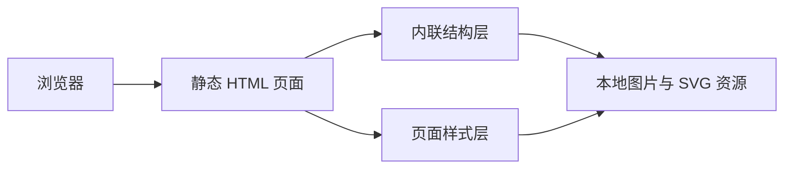

## 1. 架构设计

## 2. 技术描述
- 前端：原生 HTML5 + CSS3 + 少量原生 JavaScript
- 资源组织：复用项目内已有图片、SVG 与本地静态资源目录
- 适配策略：固定画布 + 视口缩放
- 开发原则：以视觉还原优先，避免不必要的数据驱动和复杂交互

## 3. 路由定义
| 路由 | 用途 |
|------|------|
| `/index/page6_5.html` 或等效静态入口 | 展示 6_5 高还原页面 |

## 4. 接口定义
- 本页面为纯静态展示页，不依赖后端接口
- 所有图形与说明均由本地结构、样式和静态资源完成

## 5. 数据与资源策略
### 5.1 资源使用
- 优先使用 `.figma/image/` 内导出的 PNG、SVG 资源
- 对于文字、圆点、线条、渐变与简单几何形状，直接使用 HTML/CSS 重建
- 对于复杂图表轮廓和异形底板，优先使用导出图片或 SVG 作为背景素材

### 5.2 还原策略
- 主画布使用单一根容器承载，所有关键元素采用绝对定位
- 保留原设计稿中的透明度、旋转角度、渐变方向与模糊感
- 使用分层结构控制 `z-index`，确保标题、说明、图例与主视觉关系正确
- 对英文装饰标题和小字说明设置细字重与字距，接近设计稿气质

## 6. 结构拆分
| 模块 | 实现方式 |
|------|----------|
| 根画布 | 固定尺寸容器，负责背景、整体定位和缩放基准 |
| 左侧标题区 | HTML 文本 + 本地图片，使用绝对定位还原竖排结构 |
| 中央主视觉区 | 本地大图/矢量 + CSS 装饰层叠加 |
| 左下说明区 | 若干独立信息块，使用渐变圆、细线和 PNG 组合 |
| 右上说明区 | 文本图例与小型装饰点阵，保持轻量透明感 |
| 页脚区 | 文字与箭头素材组合，贴近设计稿位置排布 |

## 7. 验收标准
- 首屏视觉构图与截图保持高一致度
- 各模块位置、大小、间距和透明度肉眼比对误差最小
- 浏览器打开后无资源 404、无明显布局错位、无控制台报错
