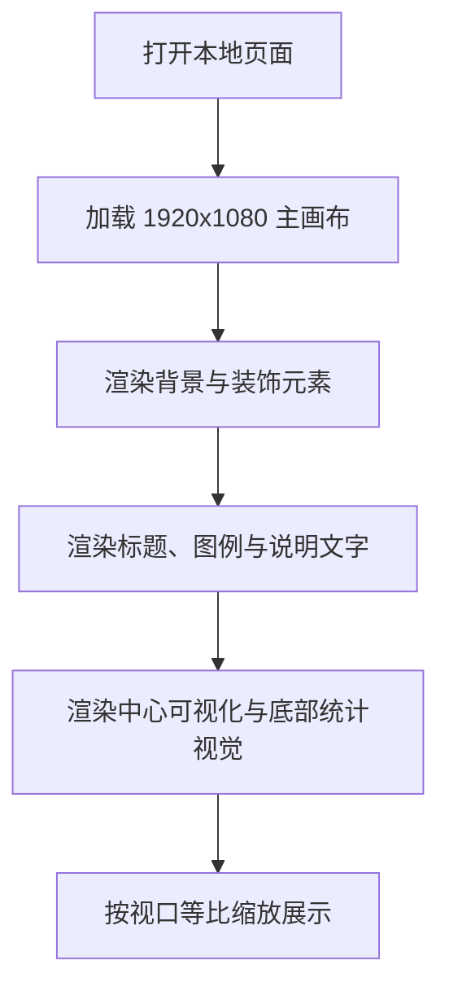

## 1. 产品概述
基于提供的 Figma 截图与导出结构，生成一个 1920x1080 的单页信息可视化网页，高度还原版式、层级、配色、透明度与图形关系。
- 页面用于展示“2025年雁类迁徙信息可视化”，目标是达到接近设计稿的视觉复现与本地可预览交付。
- 产出优先保证桌面端大屏展示效果，其次兼顾浏览器缩放时的整体稳定性。

## 2. 核心功能
### 2.1 功能模块
1. **主展示页**：单屏大画布、固定构图、分区信息可视化、装饰图形、标题与说明文案。
2. **预览入口**：可直接在本地浏览器打开进行视觉对照与验收。

### 2.2 页面明细
| 页面名称 | 模块名称 | 功能说明 |
|-----------|-----------|-----------|
| 6_5 页面 | 画布容器 | 固定 1920x1080 设计稿尺寸，整体缩放适配视口 |
| 6_5 页面 | 左侧标题区 | 竖排主标题、辅助英文、副标题与装饰飞鸟 |
| 6_5 页面 | 右上说明区 | 页面主题、月份观测说明、图示图例 |
| 6_5 页面 | 中央主视觉区 | 极坐标图、热场地图、图例、说明标注 |
| 6_5 页面 | 左下特征总结区 | 卡片式结构、渐变圆斑、鸟类素材与说明文字 |
| 6_5 页面 | 底部统计区 | 双侧面积折线视觉、数据来源、页脚标题 |

## 3. 核心流程
用户打开本地页面后，首先看到完整单屏视觉稿；页面以固定画布居中展示，并按照浏览器视口进行等比缩放；用户无需交互即可完成浏览和截图验收。

## 4. 用户界面设计
### 4.1 设计风格
- 主色：浅灰白雾面背景、低饱和蓝色系、低饱和粉红系
- 辅色：棕灰文字、浅蓝描边、半透明白与雾化渐变
- 按钮样式：仅保留设计稿中的细边框标签块，不增加额外交互按钮
- 字体建议：中文使用 `PingFang SC`，英文标题使用偏装饰性的衬线或扩展体替代方案
- 布局风格：海报式绝对定位布局，强调留白、漂浮感与柔和层次
- 图形风格：半透明渐变圆斑、细线、低对比图例、贴图和矢量混合编排

### 4.2 页面设计概览
| 页面名称 | 模块名称 | UI 元素 |
|-----------|-----------|-----------|
| 6_5 页面 | 背景层 | 斜向浅灰渐变背景、弱雾化氛围 |
| 6_5 页面 | 主标题区 | 竖排标题、英文副标题、飞鸟插图、细描边标签 |
| 6_5 页面 | 中央图表区 | 极坐标线网、地图贴图、热场点阵、分类图例 |
| 6_5 页面 | 特征总结区 | 异形卡片背景、鸟类 PNG、渐变光斑、短文本标签 |
| 6_5 页面 | 底部信息区 | 面积山形图、页脚中英文标题、右侧长文说明 |

### 4.3 响应式策略
- 采用桌面优先方案，以 1920x1080 为唯一设计基准
- 小于设计稿视口时通过整体 `transform: scale()` 等比缩放
- 保持所有元素的相对坐标与层级关系不变，避免流式重排影响还原度
