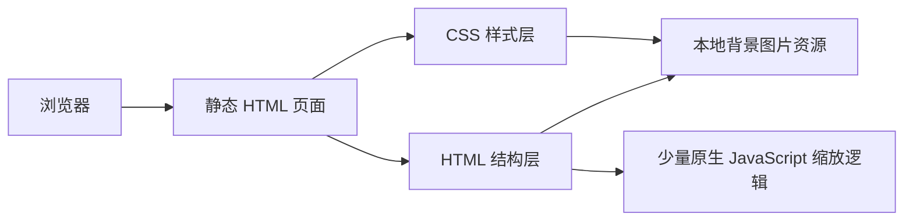

## 1. 架构设计

## 2. 技术描述
- 前端：原生 HTML5 + CSS3 + 少量原生 JavaScript
- 页面类型：单入口静态封面页
- 适配策略：固定画布 + 居中缩放
- 开发原则：优先使用本地导出图片资源还原 Figma 构图，减少不必要的结构拆分

## 3. 路由定义
| 路由 | 用途 |
|------|------|
| `/feather.html` | 展示雁南飞主题封面页高还原实现 |

## 4. 接口定义
- 本页面不依赖后端接口
- 所有视觉元素均由本地静态资源、文本结构和样式完成

## 5. 数据与资源策略
### 5.1 资源使用
- 优先使用项目内已存在的背景主图和底部倒影图片资源
- 右侧箭头使用 CSS 绘制或保留为轻量矢量结构
- 字体以系统可用字体为基础，并提供与设计稿接近的英文装饰字体降级链

### 5.2 还原策略
- 根容器保持 1920x1080 固定尺寸，整体居中显示
- 背景主图与倒影图使用绝对定位，分别控制裁切区域和透明度
- 文案、箭头与边距位置严格按 Figma 节点坐标还原
- 页面背景使用纵向渐变，补齐图片之外的留白层次

## 6. 结构拆分
| 模块 | 实现方式 |
|------|----------|
| 根画布 | 固定尺寸容器，负责背景渐变、定位基准和整体缩放 |
| 背景主视觉区 | 绝对定位图片层，覆盖画布主要高度 |
| 倒影过渡区 | 绝对定位图片层，控制底部叠加与透明度 |
| 顶部英文标识 | 文本节点绝对定位，保持右上对齐 |
| 右侧导视箭头 | 细线图形节点绝对定位，作为单独装饰层 |
| 底部信息区 | 中文标题与英文标题绝对定位，保持左下排版关系 |

## 7. 验收标准
- 页面整体构图、文字位置和图像裁切与 Figma 保持高一致度
- 浏览器中资源无 404、无明显错位、无控制台报错
- 不同桌面尺寸下页面保持完整展示，无滚动条和内容溢出
