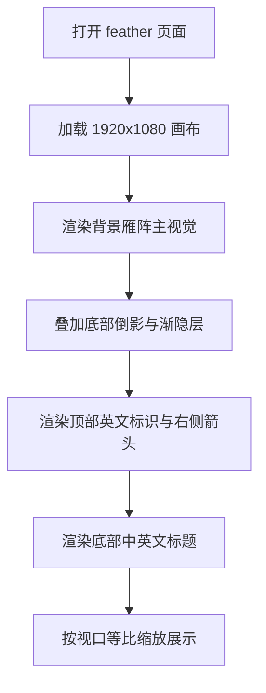

## 1. 产品概述
基于提供的 Figma 节点 `1:624`，生成一个 1920x1080 的单页静态视觉网页，用于呈现“雁南飞”主题开场海报，并高还原原稿中的背景雁阵、倒影与中英文标题布局。
- 页面主要承担项目封面或章节引导作用，突出氛围感、留白和品牌识别。
- 产出优先保证本地浏览器中的视觉一致性，适合后续与其他页面串联展示。

## 2. 核心功能
### 2.1 功能模块
1. **封面主视觉页**：展示大幅雁群图、倒影层、顶部英文标识、右侧箭头和底部标题信息。
2. **本地预览入口**：可直接在浏览器打开进行视觉核对与验收。

### 2.2 页面明细
| 页面名称 | 模块名称 | 功能说明 |
|-----------|-----------|-----------|
| feather 页面 | 背景主视觉区 | 呈现整幅雁群图，作为页面主要视觉焦点 |
| feather 页面 | 倒影过渡区 | 在底部叠加半透明倒影，形成镜面与空间延展感 |
| feather 页面 | 顶部英文标识 | 右上显示 `Wild geese fly south` 英文标题 |
| feather 页面 | 右侧导视箭头 | 右侧中部显示竖向箭头装饰，强化页面流向感 |
| feather 页面 | 底部信息区 | 左下展示中文标题与英文副标题，构成页面身份说明 |

## 3. 核心流程
用户打开本地页面后，首先看到完整的单屏封面构图；页面保持固定画布比例并居中显示，在不同视口中通过等比缩放适配；用户无需滚动或交互即可完成浏览与截图比对。

## 4. 用户界面设计
### 4.1 设计风格
- 主色：雾白至浅灰蓝纵向渐变背景
- 辅色：低饱和棕灰文字、浅灰褐装饰线、低透明度图像层
- 标签样式：极简排版，无实色面板，依靠留白和字重建立层级
- 字体建议：中文使用 `PingFang SC`，英文装饰标题优先匹配 `Padyakke Expanded One`，无该字体时提供近似替代
- 布局风格：桌面端海报式构图，大面积留白，强调上下呼应与右侧导视
- 图形风格：摄影图像叠加、柔和渐隐、细线箭头和轻量排版

### 4.2 页面设计概览
| 页面名称 | 模块名称 | UI 元素 |
|-----------|-----------|-----------|
| feather 页面 | 背景主视觉区 | 大幅雁群图片、居中铺展、轻微空气感蒙层 |
| feather 页面 | 倒影过渡区 | 底部局部裁切图像、低透明度处理、柔和遮罩 |
| feather 页面 | 顶部英文标识 | 右上小字号英文标题、深棕灰色 |
| feather 页面 | 右侧导视箭头 | 细描边竖向箭头、位于页面右侧中段 |
| feather 页面 | 底部信息区 | 左下中文标题与英文长标题，上下排列并保留充足留白 |

### 4.3 响应式策略
- 采用桌面优先方案，以 1920x1080 为唯一设计基准
- 页面整体使用固定画布并通过 `transform: scale()` 或 `aspect-ratio` 等比缩放
- 不做流式重排，确保图像裁切、文字位置与箭头锚点稳定
