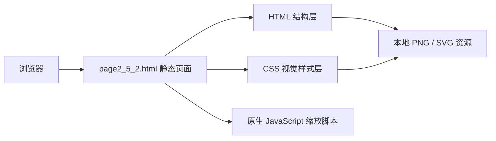

## 1. 架构设计

## 2. 技术描述
- 前端：原生 HTML5 + CSS3 + 少量原生 JavaScript
- 资源组织：复用项目内现有 `image/page9/` 图标和中心配图等静态资源
- 页面形态：单 HTML 静态展示页，无框架依赖、无后端接口
- 适配方式：固定画布 + `transform` 等比缩放
- 开发原则：优先视觉高还原，避免不必要的动画、组件化和数据逻辑

## 3. 路由定义
| 路由 | 用途 |
|------|------|
| `/page2_5_2.html` | 展示“呼吁2 / 保护”高还原静态页面 |

## 4. 接口定义
- 本页面为纯静态页面，不依赖外部接口或后端服务
- 所有文案、图标、图片与背景效果均在页面内直接完成渲染

## 5. 数据与资源策略
### 5.1 资源使用
- 优先复用项目中已存在的 `image/page9/center_image.png` 及 5 个相关 SVG 图标
- 文字、圆环、节点描边、背景渐变与柔光效果由 HTML/CSS 直接绘制
- 右侧翻页箭头使用字符或已有箭头素材实现，避免引入额外依赖

### 5.2 还原策略
- 使用单一根画布容器作为 1920x1080 设计基准
- 所有核心元素采用绝对定位，确保与设计稿位置关系一致
- 通过多层径向渐变和轻量伪元素模拟左右粉蓝光晕、中心发光与透明叠层
- 使用细描边圆环、半透明节点底板和轻量阴影还原设计稿的柔和科技感
- 保持文字层级清晰：中心标题最醒目，其余说明文案弱化显示

## 6. 结构拆分
| 模块 | 实现方式 |
|------|----------|
| 根画布 | 固定尺寸容器，负责背景基底、整体定位和缩放基准 |
| 品牌角标区 | HTML 文本绝对定位，使用轻衬线字体模拟设计稿英文角标 |
| 中央主视觉区 | 圆环、中心图片、标题与内发光叠层组合实现 |
| 行动节点区 | 5 个图标节点绝对定位分布在圆环周围，单个节点可做轻微高亮 |
| 环绕文案区 | 对应节点的标题和正文使用独立文本块定位布局 |
| 页脚与箭头区 | 左下双语页脚和右侧箭头独立分层，保持与主视觉分离 |

## 7. 验收标准
- 页面首屏截图与 Figma 设计稿在构图、颜色、层次和留白上保持高一致度
- 资源路径正确，无图片缺失、无控制台报错、无明显错位
- 浏览器窗口变化时页面仍保持整体等比展示，不出现局部拉伸和流式重排
