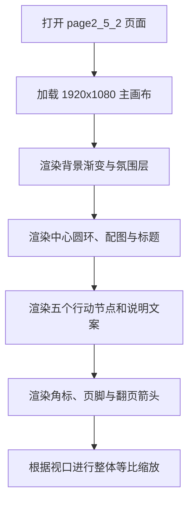

## 1. 产品概述
`page2_5_2.html` 对应 Figma 节点 `100:106` 的“呼吁2 / 保护”页面，目标是在本地以原生 HTML/CSS/JavaScript 一比一还原 1920x1080 单屏视觉稿。
- 页面用于“2025年雁类迁徙信息可视化”中的保护主题表达，强调中心圆环、五个行动节点、环绕说明文案与柔和氛围背景的完整复现。
- 交付优先保证桌面端大屏静态展示精度，其次保证不同浏览器窗口下的整体等比缩放稳定性。

## 2. 核心功能
### 2.1 功能模块
1. **保护主题展示页**：固定尺寸主画布、背景光晕、中心主视觉、5 个环形节点、5 组说明文案、品牌角标、页脚与翻页箭头。
2. **本地预览入口**：可直接打开单个 HTML 文件进行视觉核对与验收。

### 2.2 页面明细
| 页面名称 | 模块名称 | 功能说明 |
|-----------|-----------|-----------|
| page2_5_2 页面 | 主画布容器 | 以 1920x1080 为设计基准，承载所有绝对定位视觉元素 |
| page2_5_2 页面 | 背景氛围层 | 浅灰底色与左右低饱和粉蓝渐变光斑，形成柔和保护主题气质 |
| page2_5_2 页面 | 中央主视觉区 | 圆环、中心配图与“保护”标题，构成页面视觉核心 |
| page2_5_2 页面 | 节点图标区 | 5 个围绕圆环分布的圆形图标节点，表现 5 类保护行动 |
| page2_5_2 页面 | 文案说明区 | 与对应节点配套的说明标题和正文，固定分布在圆环四周 |
| page2_5_2 页面 | 品牌与页脚区 | 右上英文角标、左下双语页脚、右侧翻页箭头 |

## 3. 核心流程
用户打开本地页面后，页面直接显示完整的“保护”主题单屏构图；主画布根据浏览器视口进行等比缩放，以保持设计稿中的位置、比例与层次关系；用户无需复杂交互即可完成浏览和截图验收。

## 4. 用户界面设计
### 4.1 设计风格
- 主色：雾面浅灰背景、低饱和粉色渐变、低饱和浅蓝渐变
- 辅色：棕灰文字、浅棕灰细描边、半透明白色高光
- 按钮样式：无常规按钮，仅保留设计稿中的箭头式翻页提示
- 字体建议：中文使用 `PingFang SC` / `Noto Sans SC`，英文角标与页脚副文使用轻盈衬线字体
- 布局风格：海报式单屏绝对定位布局，中心聚焦，四周留白
- 图形风格：细线圆环、半透明圆形节点、柔和径向渐变与低对比插图

### 4.2 页面设计概览
| 页面名称 | 模块名称 | UI 元素 |
|-----------|-----------|-----------|
| page2_5_2 页面 | 背景层 | 浅灰底、左粉右蓝大面积柔光、轻薄纵向过渡 |
| page2_5_2 页面 | 中央主视觉 | 外环描边、中心鸟类配图、内发光与“保护”标题 |
| page2_5_2 页面 | 节点层 | 5 个圆形图标节点、外环细描边、局部高亮状态 |
| page2_5_2 页面 | 说明文案层 | 节点标题、简短正文、左右上下环绕排布 |
| page2_5_2 页面 | 品牌层 | 右上英文角标、左下中英页脚、右侧箭头 |

### 4.3 响应式策略
- 采用桌面优先方案，以 1920x1080 为唯一设计基准
- 页面不进行流式重排，而是通过整体 `transform: scale()` 适配不同视口
- 保持元素相对坐标、字号比例和层级关系稳定，优先保障视觉还原
