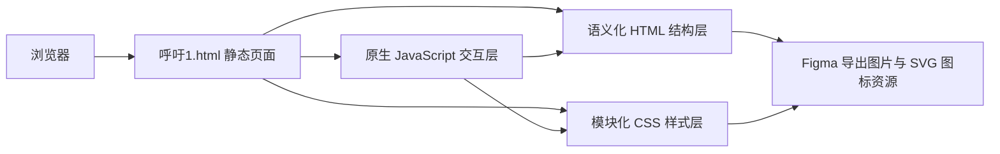

## 1. 架构设计

## 2. 技术描述
- 前端：原生 HTML5 + CSS3 + 原生 JavaScript
- 页面类型：单入口高还原静态展示页
- 布局策略：桌面优先固定画布 + 多断点响应式适配
- 样式组织：语义化分区类命名 + CSS 自定义属性 + 可复用状态类
- 交互原则：仅为图标、中心主视觉和导视箭头添加克制动效，确保整体观感保持海报化

## 3. 路由定义
| 路由 | 用途 |
|------|------|
| `/呼吁1.html` | 展示 `601:1874` 节点对应的高还原行动呼吁页面 |

## 4. 接口定义
- 本页面不依赖后端接口
- 所有内容均以内嵌静态文案、本地图像资源和本地 SVG 呈现

## 5. 资源策略
### 5.1 图像资源
- 从 Figma 下载中心图片 `601:1881` 对应的裁切 PNG，保持原稿中矩形裁切比例
- 五个行动图标优先下载为 SVG，确保在缩放和高分屏下保持清晰
- 页面背景使用纯色与 CSS 模糊光斑模拟，不依赖额外位图背景

### 5.2 字体策略
- 英文装饰标题使用 `Padyakke Expanded One` 风格，并提供 `Georgia`、`Times New Roman` 等衬线降级链
- 中文主体文案使用 `PingFang SC`、`Microsoft YaHei`、`Noto Sans SC` 等无衬线降级链
- 通过字距、行高、抗锯齿和平滑渲染优化接近设计稿观感

## 6. 结构拆分
| 模块 | 实现方式 |
|------|----------|
| 页面根层 | `main` 作为主内容区域，承担背景、缩放与安全边距控制 |
| 顶部标题层 | `header` 节点承载右上英文标题 |
| 底部信息层 | `footer` 节点承载左下中英文信息 |
| 主视觉层 | `section` 承载主圆描边、中心图片和标题 |
| 图标环层 | 5 个独立可聚焦节点承载 SVG 图标与说明语义 |
| 文案说明层 | 左上与右下两个文本块绝对定位，保持原稿留白关系 |
| 导视箭头层 | 使用 `button` 或 `a` 语义节点承载 SVG 箭头与状态动画 |

## 7. 响应式方案
- `>= 1440px`：保持接近原稿的绝对定位与尺寸
- `768px - 1439px`：按比例缩小圆环、图标和文本块宽度，维持中轴构图关系
- `< 768px`：改用视口单位与 `clamp()` 调整尺寸，并重排说明文案避免遮挡主视觉
- 使用 CSS 变量统一控制主圆直径、图标尺寸、标题字号与边距偏移

## 8. 交互与动效方案
- 页面加载时，中央主视觉、图标和文字依次淡入，形成轻量序列感
- 行动图标在 `hover` / `focus-visible` 状态下执行轻微上浮、描边提亮与投影增强
- 中心图片区域在 hover 时增加柔和阴影，强调页面关注点
- 导视箭头在 `hover` / `focus-visible` 状态下执行轻微下移与透明度变化
- 所有动效需支持 `prefers-reduced-motion` 降级

## 9. 验收标准
- 页面整体尺寸、图像裁切、文字位置与 Figma 节点坐标高度一致
- 桌面端 Chrome DevTools 对比时，主要元素位置与尺寸偏差控制在 1px 至 2px 内
- Chrome、Safari、Edge、Firefox 中无明显布局错位、字体溢出或脚本报错
- 可聚焦元素具备可见焦点态，满足基本键盘可访问性与展示验收需要
