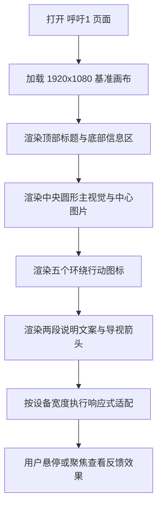

## 1. 产品概述
基于提供的 Figma 节点 `601:1874`，实现一个 1920x1080 的单屏高还原行动呼吁页，用于承接“2025 年雁类迁徙信息可视化”项目中的保护倡议章节，完整复现主视觉圆环、五个行动图标、标题文案与双段说明文本。
- 页面目标是将抽象的迁徙保护议题转化为可感知、可参与的视觉呼吁，强化“保护雁类”主题和公众参与感。
- 交付需覆盖桌面、平板、手机等视口下的等比适配与细节还原，便于后续与其他页面联动展示和验收截图比对。

## 2. 核心功能
### 2.1 功能模块
1. **行动呼吁主画面**：展示中央圆形主视觉、外圈描边、中心图片与页面背景层次。
2. **五项保护行动图标**：围绕中心图布置五个 SVG 图标，形成环绕式信息引导。
3. **标题与信息文案**：呈现顶部英文标题、底部中英文副标题、中心中文主标题与两段说明文案。
4. **轻量交互反馈**：为行动图标、中心主视觉与导视箭头提供 hover、focus-visible、active 等弱动效反馈。
5. **多端响应展示**：保持原稿构图、图文层级与留白关系，在不同设备宽度下稳定呈现。

### 2.2 页面明细
| 页面名称 | 模块名称 | 功能说明 |
|-----------|-----------|-----------|
| 呼吁1 页面 | 画布容器 | 提供 1920x1080 设计基准、浅灰背景和绝对定位基线 |
| 呼吁1 页面 | 顶部英文标题 | 右上显示 `Wild geese fly south` 作为项目英文标识 |
| 呼吁1 页面 | 底部信息区 | 左下显示 `2025年雁类迁徙信息可视化` 与英文副标题 |
| 呼吁1 页面 | 中央主视觉区 | 展示圆形描边、中心主图与主标题 `保护` |
| 呼吁1 页面 | 行动图标环 | 在主视觉周边分布五个图标，形成行动提示与视觉节奏 |
| 呼吁1 页面 | 左上说明文案 | 显示第一段倡议说明，承担背景阐释功能 |
| 呼吁1 页面 | 右下说明文案 | 显示第二段倡议说明，强化参与号召 |
| 呼吁1 页面 | 导视箭头 | 右下角显示细描边箭头，承载继续浏览的视觉提示 |

## 3. 核心流程
用户打开页面后，首先看到完整单屏倡议海报；页面按桌面优先策略加载，并依据当前视口进行等比缩放与边距保护；用户可将焦点切入各行动图标或导视箭头，查看轻量状态反馈；页面无需滚动即可完成信息浏览、展示与截图验收。

## 4. 用户界面设计
### 4.1 设计风格
- 主色：页面背景使用 `#F5F6F7`，形成低饱和、雾感留白基底
- 辅色：深棕色 `#572C2C` 用于英文标题与描边，深酒红 `#522324` 用于中心标题和主圆描边，灰褐色 `#8F7F7F` 用于说明文字
- 按钮与交互样式：整体保持静态海报感，仅对五个图标、中心图与箭头提供克制的透明度、阴影与位移反馈
- 字体建议：英文优先 `Padyakke Expanded One`，中文优先 `PingFang SC`，均需设置合理降级字体链
- 布局风格：桌面优先的单屏对角构图，以中央圆形主视觉为核心，左上与右下说明文案形成张力平衡
- 图形风格：极简信息设计结合中心摄影裁切、细描边圆环和图标化动作符号，营造文献海报与公益倡议融合的视觉气质

### 4.2 页面设计概览
| 页面名称 | 模块名称 | UI 元素 |
|-----------|-----------|-----------|
| 呼吁1 页面 | 画布容器 | 单屏容器、浅灰底色、无滚动海报式布局 |
| 呼吁1 页面 | 顶部英文标题 | 20px 装饰英文字体、右上对齐、深棕色 |
| 呼吁1 页面 | 底部信息区 | 14px 中文标题 + 18px 英文副标题、左下贴边排布 |
| 呼吁1 页面 | 中央主视觉区 | 634px 主圆描边、275x163 中心图片、30px 中文主标题 |
| 呼吁1 页面 | 行动图标环 | 5 个 116px 图标节点，围绕中心图不对称分布 |
| 呼吁1 页面 | 说明文案区 | 两段 16px 中文说明文字，行高约 2.5 倍，强调留白与呼吸感 |
| 呼吁1 页面 | 导视箭头 | 右下角细线箭头，hover 时轻微位移与提亮 |

### 4.3 响应式策略
- 采用桌面优先方案，以 1920x1080 作为唯一设计基准
- 桌面端优先使用固定画布等比缩放，保证与 Figma 的位置关系一致
- 平板端缩小中央主视觉、图标尺寸和说明文本宽度，确保构图完整且无重叠
- 手机端允许将说明文案改为上下分布，并适度压缩四周留白，保证标题与图标均完整可见
- 触屏环境保留点击态与焦点态，避免依赖纯 hover 才能识别交互状态
